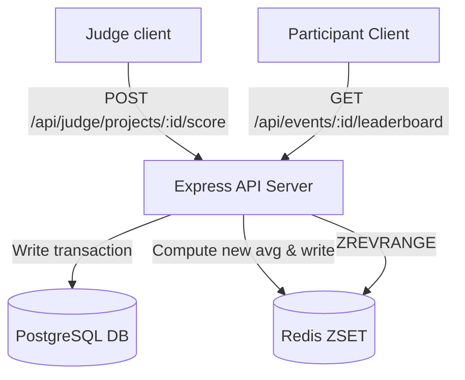
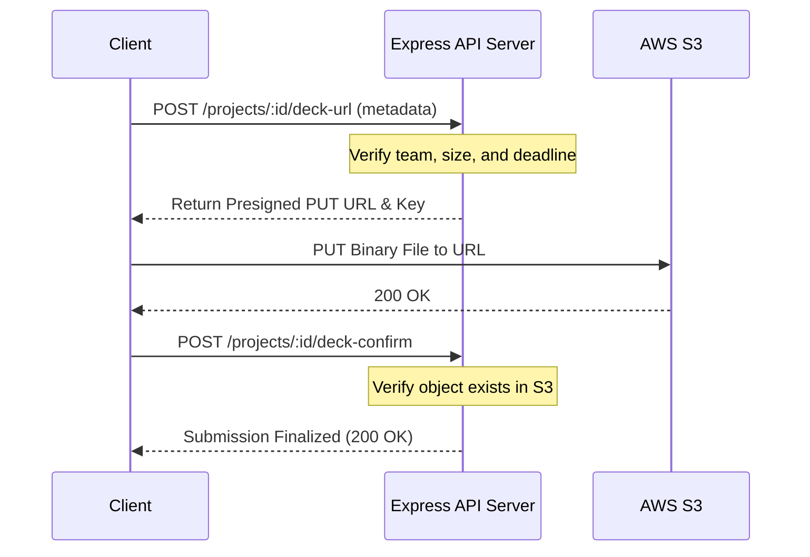

# BeetleX System Design & Scalability Tradeoffs

This document outlines the architectural decisions, scaling strategies, and database-level considerations for the BeetleX Hackathon Platform backend. It covers major bottlenecks like hot leaderboards, traffic spikes, file uploads, real-time message fan-outs, and concurrency locks.

---

## 1. Handling the Real-Time Leaderboard at Scale

### The Problem
During peak times (e.g., when the submission/judging window closes), thousands of active users will hammer the leaderboard endpoint. Concurrently, judges are submitting score updates. Running dynamic aggregates in PostgreSQL on-read is too expensive and will choke the database.



### Approach: On-Write Materialization in Redis ZSET
To handle this, we don't query raw tables on read. Instead, we compute project rankings **on-write** and store them in a Redis Sorted Set (`ZSET` at key `leaderboard:{eventId}`). 

*   **Why this works**: On-read SQL aggregations (`AVG`, `SUM`, `JOIN`) on hundreds of projects and thousands of scores require heavy table scans and sort phases. By computing averages on score submission and writing to a Redis ZSET, leaderboard fetches become simple $O(\log N + M)$ queries (where $M$ is the page size). 
*   **PostgreSQL Materialized Views**: Standard SQL materialized views are too slow for real-time updates since refreshing them locks tables or adds lag. Redis ZSET provides instant updates.

### Caching and Invalidation Flow
1.  **ZSET Structure**: Key is `leaderboard:{eventId}`. Members are `projectId` strings. The score is a compound double value:
    $$\text{Score} = \text{Average Score} + \left(1.0 - \frac{\text{submittedAt Timestamp}}{1\text{e}13}\right)$$
    *This handles tie-breaking. Higher scores rank first. If two projects have identical averages, the one submitted earlier has a smaller timestamp fraction subtracted, placing it higher.*
2.  **Detail Cache**: Project details (team name, track, title) are cached as JSON strings under `project:{projectId}` with a 1-hour TTL.
3.  **Invalidation**: When a judge saves a score:
    *   The write is committed to PostgreSQL.
    *   We query the project's new average score.
    *   We call `ZADD` to update the project's score in the event's Redis ZSET.
    *   For safety, a cron job rebuilds the ZSET directly from the DB every 2 hours to fix any drift.

### Core Database Indexes
To support fast recalculations and fallback reads, we use these indexes:

```sql
-- Fast filter for active submitted projects
CREATE INDEX idx_projects_leaderboard_filter 
ON projects (event_id, status, is_active) 
WHERE status = 'SUBMITTED' AND is_active = TRUE;

-- Fast aggregations of project scores
CREATE INDEX idx_scores_project_aggregation 
ON scores (project_id, total);
```

### Real-Time Update Delivery
Instead of having clients poll the API, we use **Server-Sent Events (SSE)**.
*   When a score is updated, the server publishes a message to Redis Pub/Sub: `PUBLISH leaderboard:{eventId}:updates '{"refresh": true}'`.
*   API instances holding open SSE connections catch this event, pull the fresh page from Redis, and stream it to the clients as a JSON payload.

---

## 2. Managing 50,000 Registrations / Day

### The Problem
If a popular event goes live or gets featured in a major newsletter, a massive spike of concurrent signups can easily saturate the database connection pool or result in duplicate rows.

### Duplicate Prevention at the Database Layer
We enforce uniqueness using a database-level composite unique constraint:
```sql
ALTER TABLE registrations ADD CONSTRAINT unique_event_user UNIQUE (event_id, user_id);
```
Even if concurrent requests bypass application-level checks, PostgreSQL's index engine locks the unique index key during the write. The winning transaction commits, while the loser fails with a `23505` constraint violation. The controller catches this and returns an HTTP `409 Conflict` to prevent double-booking.

### Rate Limiting
To prevent brute-force attacks and socket exhaustion, we apply rate limiting at three layers:
1.  **Edge / Proxy (Cloudflare/Nginx)**: Block IPs making more than 100 requests per 10 seconds.
2.  **User Layer (Redis Token Bucket)**: Limit individual authenticated users to 10 signup attempts per minute.
3.  **Route Layer**: Cap calls to the registration endpoint to 100 per minute per event to protect the DB from direct spikes.

### Write Queue vs Direct Writes
At 50k registrations/day, the average write rate is tiny (~0.6 RPS), with peak surges of 100–200 RPS. 
*   **Direct writes** are preferred for signups because users expect instant confirmation (`201 Created`). 
*   **Queues (BullMQ/Redis)**: We only use queues for registration side-effects (e.g., sending confirmation emails, generating tickets, or calling CRM APIs). The signup is written to the DB synchronously, and a job is fired to BullMQ. Background workers handle the slow network IO of email delivery.

### Database Pool Tuning
To support sustained write spikes, PgBouncer is configured in **transaction mode** (`pool_mode = transaction`). This lets thousands of client connections pool down to a smaller, stable set of PostgreSQL connections.

Recommended settings:
```ini
# PostgreSQL parameters
max_connections = 200
shared_buffers = 4GB             # 25% of a 16GB server RAM
work_mem = 32MB                  # Avoid sorting on disk
effective_cache_size = 12GB
synchronous_commit = off         # Speeds up write throughput (minor crash risk tradeoff)
```

---

## 3. High-Throughput Pitch Deck Uploads

### The Problem
During the final 30 minutes before a hackathon deadline, hundreds of teams will attempt to upload their pitch deck PDFs (up to 10MB each).

### Presigned URL Flow vs Server-side Multipart
We use **Direct-to-S3 Presigned URLs**. 
If we routed file uploads through our Express API servers, the Node.js process would waste memory and CPU parsing file buffers and streaming them to S3. With 800 teams uploading 10MB files, the servers would likely trigger OOM crashes or socket exhaustion. 
With presigned URLs, the file payload goes directly from the user's browser to S3, leaving the Express server completely free to handle JSON handshakes.



### Validation Layers
1.  **Frontend**: Validate file extension and size in the UI before requesting the upload URL.
2.  **API Server**: Validate constraints (`size <= 10MB`, `mimetype === 'application/pdf'`) inside the backend controller before signing the URL.
3.  **S3 Signature**: Embed size and type restrictions directly in the S3 presigned URL parameters, ensuring AWS S3 rejects oversized uploads automatically.

### File Metadata Partitioning
*   **PostgreSQL**: Keeps light metadata (S3 key, bucket name, uploaded timestamp, file size, project reference).
*   **Object Storage (S3)**: Keeps the actual binary file, stored under prefix `decks/event-{eventId}/team-{teamId}/`.

### Failure Handling & Cleanup
*   The frontend uses S3 chunked uploads to support automatic retries. If the upload fails, the UI prompts the user to resume or retry.
*   To clean up orphaned files from aborted uploads, we configure an S3 bucket Lifecycle Policy: `AbortIncompleteMultipartUpload` after 24 hours.
*   **Malware Scanning**: We set up an AWS Lambda function triggered by S3 `ObjectCreated` events to scan PDFs using ClamAV asynchronously. If clean, the database is updated to `VERIFIED`. If infected, the file is quarantined, and the team is notified to re-upload.

---

## 4. Urgent Announcement Delivery under Load

### The Problem
An organizer extends a deadline and broadcasts a notification. The message must hit 5,000+ active participants within 10 seconds.

### Tech Stack: Redis Pub/Sub + BullMQ
*   **Redis Pub/Sub**: Handles the fast fan-out message routing across multiple server instances.
*   **BullMQ (Redis)**: Handles job persistence, priority routing, and workers.
*   *Why not Kafka?* Kafka is excellent for persistent stream replays but too complex to configure and manage for simple client broadcasts. Redis is lighter and runs with sub-millisecond latency.

### Decoupled Fan-Out
To prevent blocking our core API server process, websocket or SSE connections are handled by a dedicated **Real-time Gateway cluster**. 
1.  The organizer calls `POST /api/events/:id/announcements`.
2.  The API writes the announcement draft, publishes it, and pushes a lightweight notification object to Redis Pub/Sub: `announcements:broadcast`.
3.  The gateway instances subscribe to the channel, receive the payload, and loop through their local active sockets to write the message:
    ```typescript
    localSockets.forEach(ws => ws.send(announcement));
    ```
This asynchronous, non-blocking flow distributes the work, allowing 5,000+ connections to be served in under 200ms without slowing down the main API.

### Offline Delivery
If a user is offline, they miss the WS/SSE broadcast. To fix this, the client app calls:
`GET /api/events/:id/announcements?since={lastTimestamp}`
on reconnect or app startup, pulling any missed announcements directly from the DB.

### Write-Storm Mitigation (Read Receipts)
Creating 5,000 read receipts simultaneously when a broadcast goes out will kill the database.
*   **Unread Count**: Calculated dynamically on-read by comparing total announcements against the user's reads.
*   **Write Buffer**: Read actions are pushed to a Redis queue. A worker process batches these writes and performs a bulk database update every few seconds, converting thousands of tiny writes into a single batch transaction.

---

## 5. Handling Race Conditions in Team Operations

### The Problem
Two users attempt to join a team with only 1 slot left at the exact same millisecond. If both transactions read the database concurrently, they will both see 1 slot left and proceed to insert, exceeding the team capacity.

### Locking Choice: Pessimistic locking (`FOR UPDATE`)
*   *Why not Optimistic Locking?* Optimistic locking (using version columns) works well under low contention. However, when multiple users are racing to join a single team, optimistic locking will cause constant transaction rollbacks and retries.
*   *Pessimistic Locking* serializes requests at the database level. The first request locks the row, forcing other concurrent requests to block and wait.

### Atomic Database Transaction
We wrap the validation and member insertion inside a database transaction using a write-lock:

```sql
BEGIN;

-- Lock the team row. Concurrent join attempts block here.
SELECT id FROM teams 
WHERE id = 'team-123' AND is_active = TRUE 
FOR UPDATE;

-- Count current members
SELECT COUNT(*) FROM team_members 
WHERE team_id = 'team-123';

-- If count < maxTeamSize, write membership and commit. Else, rollback.
INSERT INTO team_members (team_id, user_id, role) 
VALUES ('team-123', 'user-abc', 'MEMBER');

COMMIT;
```

In Prisma, we implement this using execution locks:
```typescript
await prisma.$transaction(async (tx) => {
  // Lock the team row to prevent concurrent join attempts
  await tx.$executeRaw`SELECT id FROM teams WHERE id = ${teamId} FOR UPDATE`;
  
  const memberCount = await tx.teamMember.count({ where: { teamId } });
  if (memberCount >= maxTeamSize) {
    throw new AppError('Team is already full', 409, 'TEAM_FULL');
  }
  
  return tx.teamMember.create({
    data: { teamId, userId, role: 'MEMBER' }
  });
});
```

### Response Strategy
*   **Winner**: Receives a `201 Created` with membership details.
*   **Loser**: Receives a `409 Conflict` with error code `TEAM_FULL`.
*   **Scale up (Redis token lock)**: For events with massive traffic surges (e.g., ticket drops), database locking can lead to thread exhaustion. To scale beyond database limits, we offload the inventory counts to Redis. We decrement a Redis slot counter using an atomic Lua script before writing to the database. If the counter drops below 0, we reject the request immediately at the middleware layer.

### Concurrency Testing
To verify this race condition protection works, we write an integration test using concurrent execution blocks:

```typescript
it('should block exceeding team size limit under concurrent requests', async () => {
  // Trigger two join requests at the same millisecond
  const [resA, resB] = await Promise.all([
    request(app).post('/api/teams/team-123/join').set('Authorization', `Bearer ${tokenA}`),
    request(app).post('/api/teams/team-123/join').set('Authorization', `Bearer ${tokenB}`)
  ]);

  // One request must succeed, and the other must return 409
  const statuses = [resA.status, resB.status];
  expect(statuses).toContain(201);
  expect(statuses).toContain(409);
  expect(resA.body.code === 'TEAM_FULL' || resB.body.code === 'TEAM_FULL').toBe(true);
});
```
