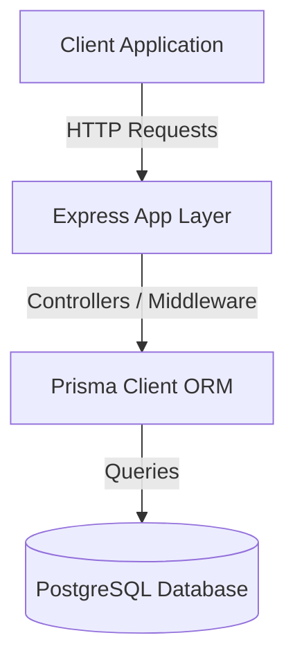

# System Design

## Architecture Overview

BeetleX Backend is designed as a modular, containerized REST API backend. It consists of the following architectural layers:

### Components

1. **Routing and Presentation Layer (`src/app.ts`, routes, and controllers)**:
   - Configured with `express`.
   - Uses `cors` for cross-origin security, `helmet` for HTTP header security, and `morgan` for developer-friendly logs.
   
2. **Database and Persistence Layer (`prisma/`)**:
   - PostgreSQL as the primary relational database.
   - Prisma Client to run database queries safely and validate relational integrity.

3. **Deployment Layer (`Dockerfile` & `docker-compose.yml`)**:
   - Containerized services orchestrate the PostgreSQL and Express Application dependencies safely.

## Future Recommendations & Scalability

- **API Versioning**: Introduce `/api/v1` namespace for routes to support multiple iterations.
- **Migration Strategy**: Configure CI/CD actions to run `npx prisma migrate deploy` upon deployment.
- **Authentication**: Set up JSON Web Token (JWT) verification middlewares for protected routes.
